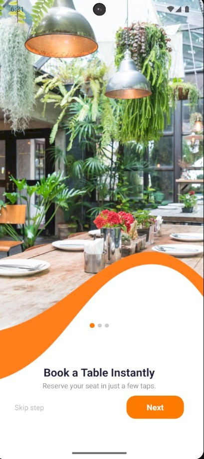
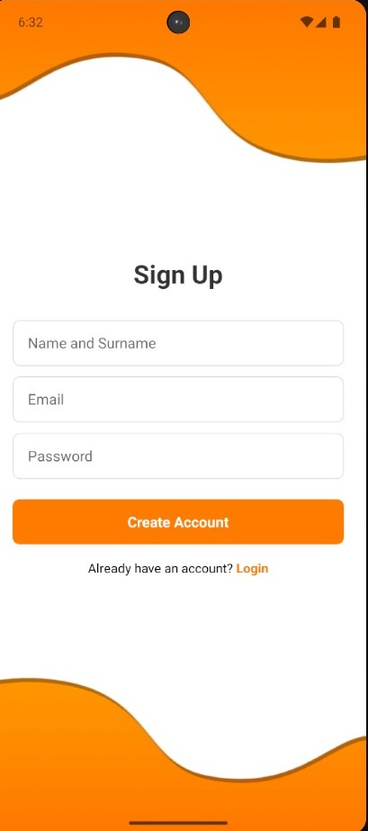
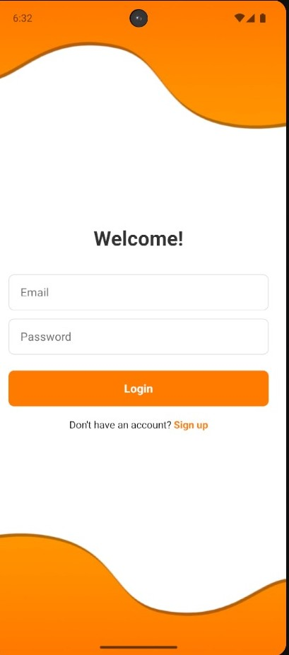
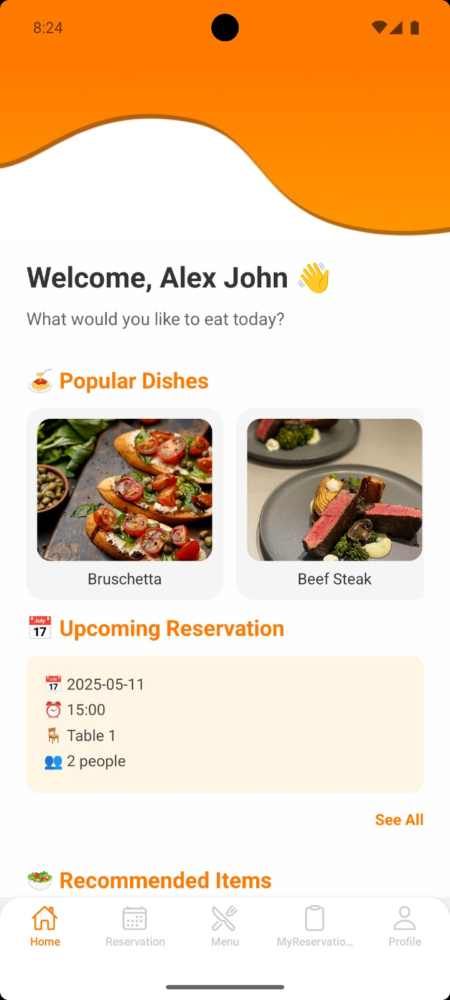
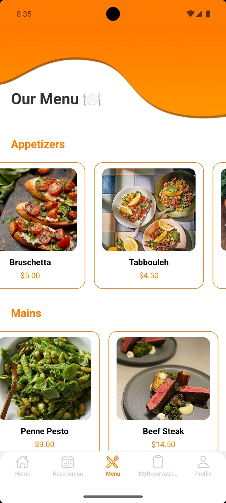
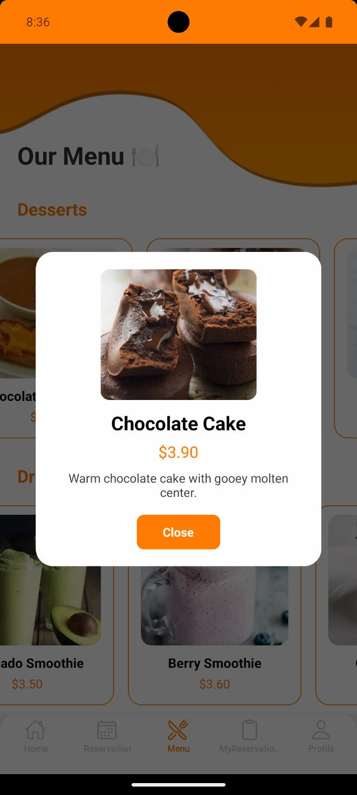
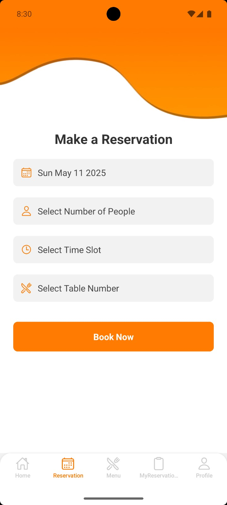
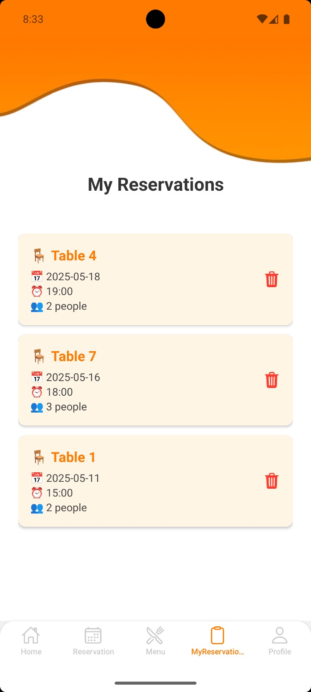
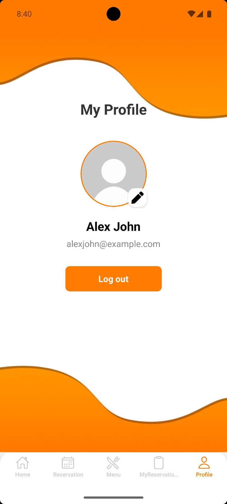

# DineHub 🍽  
**Smart & Simple Table Reservation App**  
A cross-platform mobile app for table reservations and digital menu browsing, built with React Native and SQLite.

---

## ✨ What is DineHub?

DineHub is a mobile app that helps users reserve tables at restaurants in just a few taps. It also offers a clean digital menu viewing experience. Designed for simplicity and speed, the app runs on both Android and iOS using React Native (Expo) and stores data locally with SQLite.

---

## 🔑 Core Features

- 📅 **Table Reservation** — Book a table with time selection  
- 🧾 **Digital Menu** — View dishes with descriptions and prices  
- 📱 **Offline Support** — Local storage with SQLite  
- 🧑‍🎨 **Responsive UI** — Built with a clean and intuitive design  

---

## 🛠 Tech Stack

- **Frontend:** React Native (Expo)  
- **Database:** SQLite  
- **Language:** JavaScript  
- **Platform:** Android & iOS  

---

## 📸 Screenshots

<div align="center">

### 🏠 Start Screen  


### 🚀 Onboarding Screen  


### 📝 Sign Up Screen  


### 🔐 Login Screen  


### 🏠 Home Screen  


### 📋 Menu Screen  


### 🍽️ Menu Detail Screen  


### 📆 Reservation Screen  


### 📅 My Reservation Screen  


### 👤 Profile Screen  


</div>

---

## 🔧 Installation

```bash
git clone https://github.com/yourusername/DineHub.git
cd dinehub
npm install
expo start
```

---

## 👥 Team

This project was developed by a collaborative team, working across all aspects of the app including UI design, database management, and overall development.

- **[Enes CIKCIK](https://github.com/enesckk)** 
- **[Buse İpek NACAROĞLU](https://github.com/buseipek-ncrgl)** 


